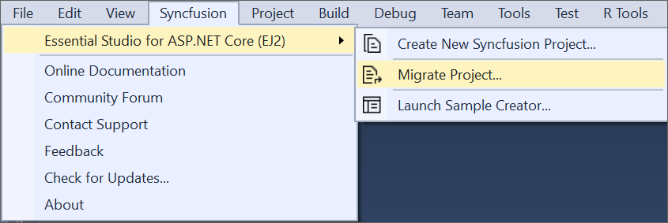

# Upgrade Project

Syncfusion Project Migration is a Visual Studio add-in that allows you to migrate the existing Syncfusion ASP.NET Core Web Application from one Essential Studio version to another version.

## IMPORTANT

The Syncfusion ASP.NET Core (Essential JS 2) Web Application Project Migration utility is available from v16.3.0.17.

The following steps help you to migrate your existing Syncfusion ASP.NET Core Web Application.

1. To open Migration Wizard, follow either one of the options below:

    **Option 1**

    Click **Syncfusion Menu** and choose **Essential Studio for ASP.NET Core (EJ2) > Migrate Project…** in **Visual Studio**.

    

    > In Visual Studio 2019, Syncfusion menu is available under Extension in Visual Studio menu.

    **Option 2**

    Right-click the **Syncfusion ASP.NET Core Application** from Solution Explorer and select **Syncfusion Essential JS 2**. Choose **Migrate the Essential JS 2 Project to Another version…**

    

2. The **Project Migration** window appears. You can choose the required Essential Studio version that is installed in the machine.

   

3. The Project Migration window allows you to configure the following options:

    * **Essential Studio Version:** Select a version from the list of installed Syncfusion versions.

    * **Assets From:** Load the Syncfusion Essential JS 2 assets to ASP.NET Core Project, either NuGet, CDN or Installed Location.

        > Installed location option will be available only when the Syncfusion Essential JavaScript 2 setup has been installed.

4. Click the **Migrate** Button. The **Project Backup** dialog appears. In the dialog, if you click **Yes**, it will backup the current project before migrating the Syncfusion project. If you click **No**, it will migrate the project to required Syncfusion version without backup.

   

5. The Syncfusion Reference Assemblies, Scripts, and CSS are updated to the corresponding version in the project.

6. If you installed the trial setup or NuGet packages from nuget.org you have to register the Syncfusion license key to your project since Syncfusion introduced the licensing system from 2018 Volume 2 (v16.2.0.41) Essential Studio release. Navigate to the [help topic](https://help.syncfusion.com/common/essential-studio/licensing/license-key#how-to-generate-syncfusion-license-key) to generate and register the Syncfusion license key to your project. Refer to this [blog](https://blog.syncfusion.com/post/Whats-New-in-2018-Volume-2-Licensing-Changes-in-the-1620x-Version-of-Essential-Studio.aspx?_ga=2.11237684.1233358434.1587355730-230058891.1567654773) post for understanding the licensing changes introduced in Essential Studio.