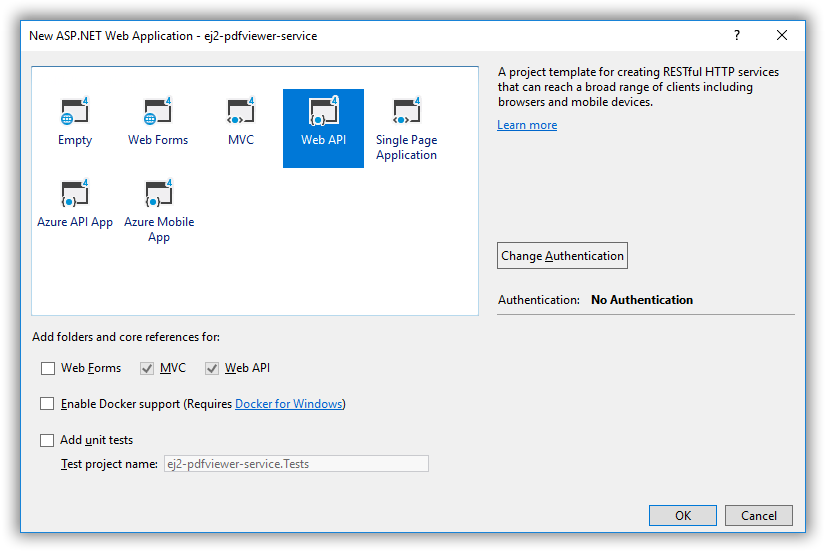
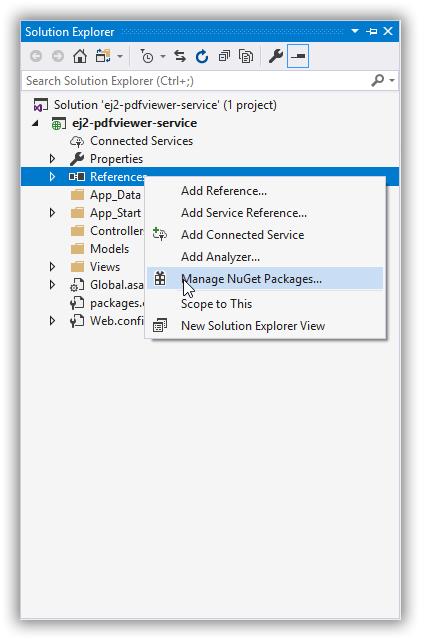
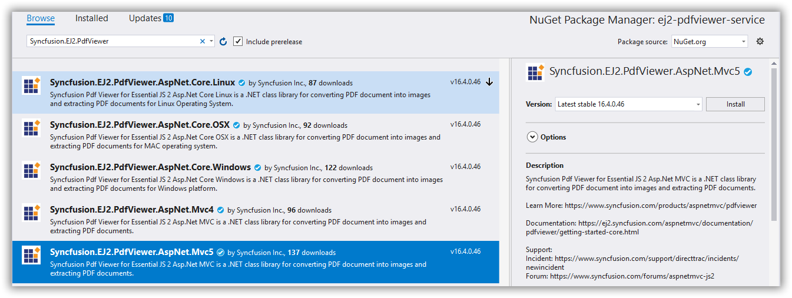
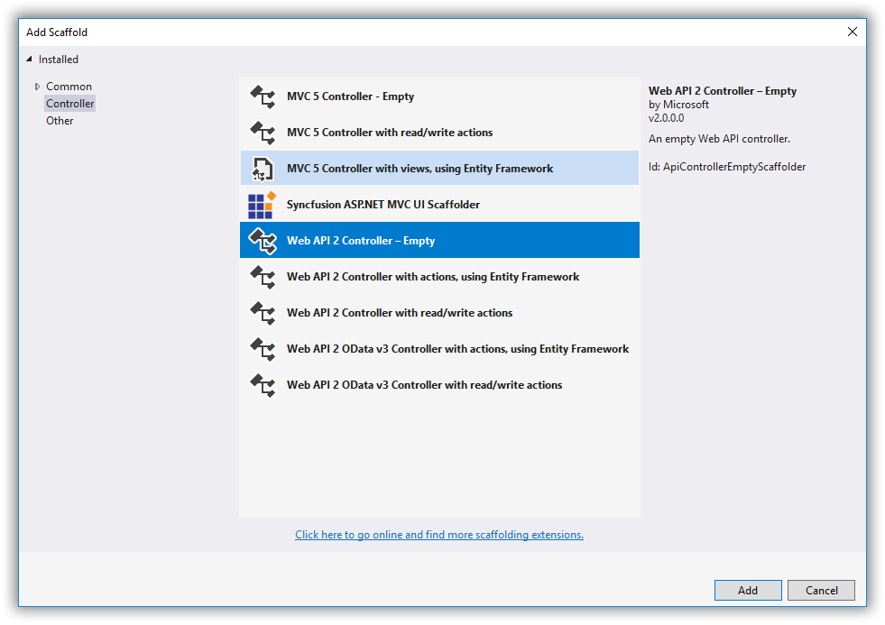

# Introduction

The Essential JavaScript PDF Viewer have server side dependency to get the details from PDF Documents for rendering. This section explains how to create the service for PDF Viewer to perform server-side preprocessing of the PDF document to be rendered in client side.

## Prerequisites

To get started with ASP.NET MVC Web API service, ensure that the following software is installed on the machine.

* .Net Framework 4.5 and above.
* ASP.NET MVC 4 or ASP.NET MVC 5
* Web API
* Visual Studio

## Setup ASP.NET MVC application with Web API for PDF Viewer service

The following steps are used to create PDF Viewer service

**Step 1:**  Create an ASP.NET web application with the default template project in Visual Studio 2017.



**Step 2:** After creating the project, add the `Syncfusion.EJ2.PdfViewer.AspNet.MVC5` dependency to your project by using 'NuGet Package Manager'.

Open the `NuGet` package manager.


Install the **Syncfusion.EJ2.PdfViewer.AspNet.Mvc5** package to the application.



**Step 3:** Add the Web API 2 Controller to the project.


**Step 4:** Add the following code to the PdfViewerController.cs, which is presented under Controller folder.,

```typescript
using Newtonsoft.Json;
using Syncfusion.EJ2.PdfViewer;
using System;
using System.Collections.Generic;
using System.IO;
using System.Linq;
using System.Net;
using System.Net.Http;
using System.Web;
using System.Web.Http;

namespace ej2_pdfviewer_service.Controllers
{
    public class PdfViewerController : ApiController
    {
        [HttpPost]
        public object Load(Dictionary<string, string> jsonObject)
        {
            PdfRenderer pdfviewer = new PdfRenderer();
            MemoryStream stream = new MemoryStream();
            object jsonResult = new object();
            if (jsonObject != null && jsonObject.ContainsKey("document"))
            {
                if (bool.Parse(jsonObject["isFileName"]))
                {
                    string documentPath = GetDocumentPath(jsonObject["document"]);
                    if (!string.IsNullOrEmpty(documentPath))
                    {
                        byte[] bytes = System.IO.File.ReadAllBytes(documentPath);
                        stream = new MemoryStream(bytes);
                    }
                    else
                    {
                        return (jsonObject["document"] + " is not found");
                    }
                }
                else
                {
                    byte[] bytes = Convert.FromBase64String(jsonObject["document"]);
                    stream = new MemoryStream(bytes);
                }
            }
            jsonResult = pdfviewer.Load(stream, jsonObject);
            return (JsonConvert.SerializeObject(jsonResult));
        }
        [HttpPost]
        public object Bookmarks(Dictionary<string, string> jsonObject)
        {
            PdfRenderer pdfviewer = new PdfRenderer();
            var jsonResult = pdfviewer.GetBookmarks(jsonObject);
            return (JsonConvert.SerializeObject(jsonResult));
        }
        [HttpPost]
        public object RenderPdfPages(Dictionary<string, string> jsonObject)
        {
            PdfRenderer pdfviewer = new PdfRenderer();
            object jsonResult = pdfviewer.GetPage(jsonObject);
            return (JsonConvert.SerializeObject(jsonResult));
        }
        [HttpPost]
        public object RenderThumbnailImages(Dictionary<string, string> jsonObject)
        {
            PdfRenderer pdfviewer = new PdfRenderer();
            object result = pdfviewer.GetThumbnailImages(jsonObject);
            return (JsonConvert.SerializeObject(result));
        }
        [HttpPost]
        public object Unload(Dictionary<string, string> jsonObject)
        {
            PdfRenderer pdfviewer = new PdfRenderer();
            pdfviewer.ClearCache(jsonObject);
            return ("Document cache is cleared");
        }
        [HttpPost]
        public HttpResponseMessage Download(Dictionary<string, string> jsonObject)
        {
            PdfRenderer pdfviewer = new PdfRenderer();
            string documentBase = pdfviewer.GetDocumentAsBase64(jsonObject);
            return (GetPlainText(documentBase));
        }
        [HttpPost]
        public object PrintImages(Dictionary<string, string> jsonObject)
        {
            PdfRenderer pdfviewer = new PdfRenderer();
            object pageImage = pdfviewer.GetPrintImage(jsonObject);
            return (JsonConvert.SerializeObject(pageImage));
        }
        private HttpResponseMessage GetPlainText(string pageImage)
        {
            var responseText = new HttpResponseMessage(HttpStatusCode.OK);
            responseText.Content = new StringContent(pageImage, System.Text.Encoding.UTF8, "text/plain");
            return responseText;
        }

        // GET api/values
        public IEnumerable<string> Get()
        {
            return new string[] { "value1", "value2" };
        }


        private string GetDocumentPath(string document)
        {
            string documentPath = string.Empty;
            if (!System.IO.File.Exists(document))
            {
                var path = HttpContext.Current.Request.PhysicalApplicationPath;
                if (System.IO.File.Exists(path + "App_Data\\Data\\" + document))
                    documentPath = path + "App_Data\\Data\\" + document;
            }
            else
            {
                documentPath = document;
            }
            return documentPath;
        }
    }
}
```
