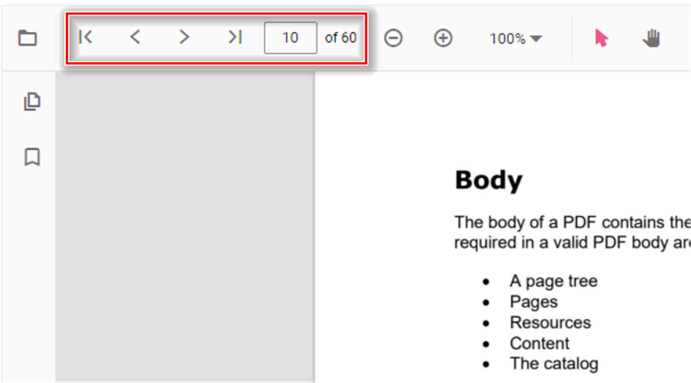
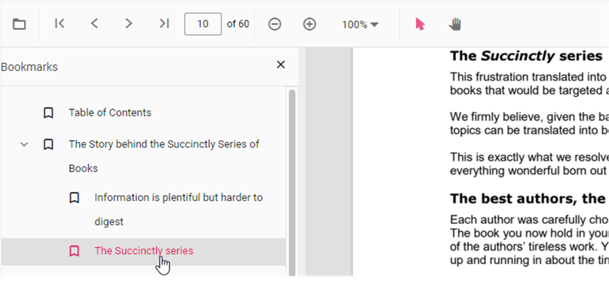
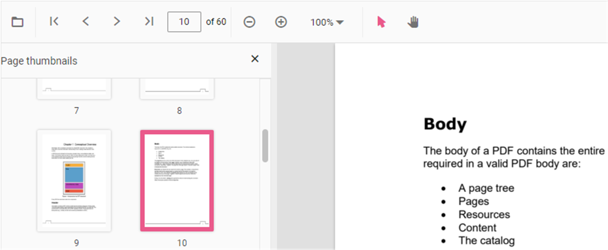
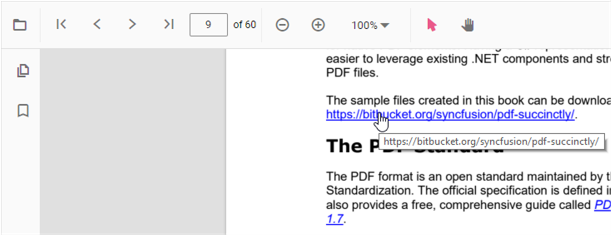
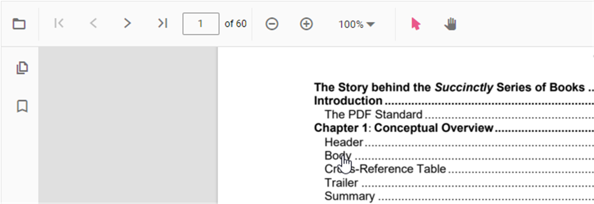

# Navigation

The ASP.NET Core PDF Viewer supports different internal and external navigations.

## Toolbar page navigation option

The default toolbar of PDF Viewer contains the following navigation options

* [**Go to page**](https://ej2.syncfusion.com/documentation/api/pdfviewer/navigation/#gotopage):- Navigates to the specific page of a PDF document.
* [**Show next page**](https://ej2.syncfusion.com/documentation/api/pdfviewer/navigation/#gotonextpage):- Navigates to the next page of PDF a document.
* [**Show previous page**](https://ej2.syncfusion.com/documentation/api/pdfviewer/navigation/#gotopreviouspage):- Navigates to the previous page of a PDF document.
* [**Show first page**](https://ej2.syncfusion.com/documentation/api/pdfviewer/navigation/#gotofirstpage):-  Navigates to the first page of a PDF document.
* [**Show last page**](https://ej2.syncfusion.com/documentation/api/pdfviewer/navigation/#gotolastpage):- Navigates to the last page of a PDF document.

```html
<!DOCTYPE html>
<html xmlns="http://www.w3.org/1999/xhtml">
<head>
<title>Essential JS 2</title>
<!-- Essential JS 2 fabric theme -->
<link href="{{:CDN_LINK}}ej2-pdfviewer/styles/fabric.css" rel="stylesheet" type="text/css"/>
<!-- Essential JS 2 PDF Viewer's global script -->
<script src="{{:CDN_LINK}}dist/ej2.min.js" type="text/javascript"></script>
</head>
<body>
<!--element which is going to render-->
<div id='container'>
<div id='PdfViewer' style="height:500px;width:100%;">
</div>
</div>
</body>
</html>
```

You can enable/disable page navigation option in PDF Viewer using the following code snippet.,

```javascript

var pdfviewer = new ej.pdfviewer.PdfViewer({
                    enableNavigation: true,
                    documentPath: "PDF_Succinctly.pdf",
                    serviceUrl: 'https://ej2services.syncfusion.com/production/web-services/api/pdfviewer'
                });
ej.pdfviewer.PdfViewer.Inject(ej.pdfviewer.TextSelection, ej.pdfviewer.TextSearch, ej.pdfviewer.Navigation,ej.pdfviewer.Print);
pdfviewer.appendTo('#PdfViewer');
```



## Bookmark navigation

The Bookmarks saved in PDF files are loaded and made ready for easy navigation.
You can enable/disable bookmark navigation by using the following code snippet.,

```javascript

var pdfviewer = new ej.pdfviewer.PdfViewer({
                    enableBookmark: true,
                    documentPath: "PDF_Succinctly.pdf",
                    serviceUrl: 'https://ej2services.syncfusion.com/production/web-services/api/pdfviewer'
                });
ej.pdfviewer.PdfViewer.Inject(ej.pdfviewer.TextSelection, ej.pdfviewer.TextSearch, ej.pdfviewer.Navigation,ej.pdfviewer.Print);
pdfviewer.appendTo('#PdfViewer');

```



## Thumbnail navigation

Thumbnails is the miniature representation of actual pages in PDF files. This feature displays thumbnails of the pages and allows navigation.
You can enable/disable thumbnail navigation by using the following code snippet.,

```javascript

var pdfviewer = new ej.pdfviewer.PdfViewer({
                    enableThumbnail: true,
                    documentPath: "PDF_Succinctly.pdf",
                    serviceUrl: 'https://ej2services.syncfusion.com/production/web-services/api/pdfviewer'
                });
ej.pdfviewer.PdfViewer.Inject(ej.pdfviewer.TextSelection, ej.pdfviewer.TextSearch, ej.pdfviewer.Navigation,ej.pdfviewer.Print);
pdfviewer.appendTo('#PdfViewer');

```



## Hyperlink navigation

Hyperlink navigation features enables navigation to the URLs (website links) in a PDF file.



## Table of content navigation

Table of contents navigation allows users to navigate to different parts of a PDF file that are listed in the table of contents section.

You can enable/disable link navigation by using the following code snippet.,

```javascript

var pdfviewer = new ej.pdfviewer.PdfViewer({
                    enableHyperlink: true,
                    documentPath: "PDF_Succinctly.pdf",
                    serviceUrl: 'https://ej2services.syncfusion.com/production/web-services/api/pdfviewer'
                });
ej.pdfviewer.PdfViewer.Inject(ej.pdfviewer.TextSelection, ej.pdfviewer.TextSearch, ej.pdfviewer.Navigation,ej.pdfviewer.Print);
pdfviewer.appendTo('#PdfViewer');

```

You can change the open state of the hyperlink in the PDF Viewer by using the following code snippet,

```javascript

var pdfviewer = new ej.pdfviewer.PdfViewer({
                    enableHyperlink: true,
                    documentPath: "PDF_Succinctly.pdf",
                    hyperlinkOpenState:'NewTab',
                    serviceUrl: 'https://ej2services.syncfusion.com/production/web-services/api/pdfviewer'
                });
ej.pdfviewer.PdfViewer.Inject(ej.pdfviewer.TextSelection, ej.pdfviewer.TextSearch, ej.pdfviewer.Navigation,ej.pdfviewer.Print);
pdfviewer.appendTo('#PdfViewer');

```



## See also

* [Toolbar items](./toolbar)
* [Feature Modules](./feature-module)